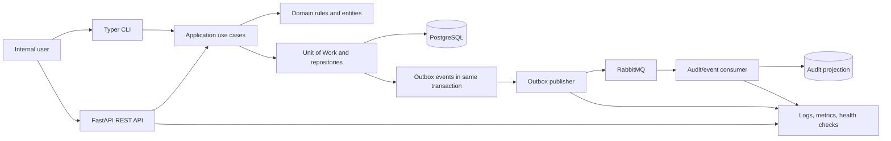

# vehicle-rental-core

Production-ready vehicle rental management service built with Python and FastAPI. Manages vehicles, rentals, availability, and maintenance using PostgreSQL, clean architecture, observability, automated testing, Docker, and extensible messaging

## Architecture



## Stack

| Concern | Choice |
| --- | --- |
| Runtime | Python 3.14 |
| Packaging | uv with `pyproject.toml` and a committed `uv.lock` |
| API | FastAPI + Uvicorn |
| Console | Typer (`vrc`) |
| Config | Pydantic + pydantic-settings |
| Persistence | SQLAlchemy 2.x (async) + psycopg 3 + PostgreSQL |
| Migrations | Alembic (async `env.py`) |
| Tests | pytest, pytest-asyncio, HTTPX, pytest-cov |
| Lint / format | Ruff (+ pre-commit) |
| Types | mypy (`strict`) |
| Metrics | prometheus-client |
| Runtime packaging | Docker + Docker Compose |

Everything is **async end to end** — FastAPI routes, SQLAlchemy sessions, and
repositories are all `async`, since this service spends most of its time waiting on
Postgres and RabbitMQ. Typer stays synchronous and crosses the boundary with a single
`asyncio.run()` per command.

## Project Structure

```txt
src/vehicle_rental_core/
├── main.py                   # ASGI entrypoint (uvicorn target)
├── api/
│   ├── app.py                # create_app() factory, lifespan, middleware
│   ├── dependencies.py       # DI providers: services, repositories, session
│   ├── errors.py             # domain error -> HTTP status mapping
│   └── routers/              # health, metrics, vehicles, rentals
├── cli/                      # Typer console: serve, healthcheck, config, db
├── core/
│   ├── config.py             # pydantic-settings Settings
│   └── observability/        # logging, prometheus metrics
├── domain/                   # Vehicle, Rental, enums, errors — no I/O, no ORM
├── application/              # VehicleService, RentalService, clock
├── schemas/                  # VehicleCreate/Update/Read, Rental*
└── infrastructure/
    ├── db/                   # Base, async engine, TimestampMixin
    ├── models/               # VehicleModel, RentalModel
    └── repositories/         # data access + domain<->ORM mappers
migrations/                   # Alembic (async env.py)
tests/                        # unit test suite (no database)
```

Dependencies point inward: `api → application → domain`, with `infrastructure`
implementing persistence. The domain layer imports neither FastAPI nor SQLAlchemy.

## Domain Model

### Why `vehicles` and not `cars`

The requested entity was a *cars* table. It is deliberately generalised to
**`vehicles`**, with the distinction carried by a `vehicle_type` column whose only
member today is `car`. Motorcycles, vans and trucks then arrive as an additive change —
a new enum member plus a migration widening one check constraint — instead of a table
rename that would break every foreign key, index, route and payload already in
production. The cost today is one column; the cost of renaming later is a migration
across the whole system.

### Naming

| Element | Convention |
|---|---|
| Domain entity | `Vehicle`, `Rental` |
| SQLAlchemy model | `VehicleModel`, `RentalModel` |
| Database table | `vehicles`, `rentals` |
| API endpoint | `/vehicles`, `/rentals` |
| Foreign key | `vehicle_id` |
| Pydantic schema | `VehicleCreate`, `VehicleUpdate`, `VehicleRead` |

Singular for Python types, plural for database tables and API collections.

### `vehicles`

| Column | Type | Notes |
|---|---|---|
| `id` | UUID | primary key |
| `vehicle_type` | enum | `car`; expandable |
| `registration_number` | varchar(32) | unique, indexed |
| `model` | varchar(128) | |
| `year` | integer | |
| `status` | enum | `available`, `in_use`, `maintenance`, `retired` |
| `retired_at` | timestamptz, null | set exactly when `status = retired` |
| `version` | integer | optimistic locking |
| `created_at` / `updated_at` | timestamptz | database-side, via `TimestampMixin` |

### `rentals`

| Column | Type | Notes |
|---|---|---|
| `id` | UUID | primary key |
| `vehicle_id` | UUID | FK → `vehicles.id`, `ON DELETE CASCADE` |
| `customer_name` | varchar(255) | |
| `start_at` | timestamptz | |
| `end_at` | timestamptz, null | **`NULL` means the rental is active** |
| `created_at` / `updated_at` | timestamptz | database-side, via `TimestampMixin` |

### Invariants

Each rule is enforced by the database, not only by application code, so concurrent
requests cannot slip between a check and a write:

| Rule | Enforced by |
|---|---|
| `end_at >= start_at` | `ck_rentals_end_at_after_start_at` |
| Registration number is unique | `ix_vehicles_registration_number` (unique) |
| Only one active rental per vehicle | `uq_rentals_one_active_per_vehicle` (partial unique) |
| `status = retired` ⟺ `retired_at IS NOT NULL` | `ck_vehicles_retired_status_matches_timestamp` |
| Retired vehicles excluded from the fleet listing | repository filters `status <> 'retired'` |
| Active rental blocks retiring and maintenance | `Vehicle.ensure_can_release`, checked in the service |
| Retiring is terminal | `Vehicle.ensure_mutable`, checked in the service |
| A retired vehicle cannot be rented | `Vehicle.is_rentable` requires `status = available` |

### Retiring a vehicle

**Retiring is the only supported way to take a vehicle out of service**, and the only
one reachable from the API. It keeps the row, the rental history and the registration
number.

A hard `DELETE` is a different operation with different semantics: it **cascades** and
takes the vehicle's rentals with it. That is deliberate — a rental row whose vehicle no
longer exists is a `vehicle_id` pointing at nothing, and durable history belongs in the
audit projection (which stores the vehicle denormalised as JSON), not in a dangling
operational row. Because it destroys records, there is no endpoint for it.

> The audit projection does not exist yet. Until the outbox lands, a hard `DELETE` is
> unrecoverable — which is another reason it is SQL-only.

`status` and `retired_at` are kept in lockstep by a check constraint, so no query ever
has to decide which of the two is authoritative. Every route into a status change goes
through `Vehicle.change_status`, so a direct field assignment cannot skip the
active-rental guard or leave the two out of step.

The partial unique index is what makes "one active rental" safe. Because it is scoped to
`WHERE end_at IS NULL`, a vehicle may accumulate any number of *ended* rentals while
holding at most one open rental:

```sql
CREATE UNIQUE INDEX uq_rentals_one_active_per_vehicle
ON rentals (vehicle_id)
WHERE end_at IS NULL;
```

The service checks availability first for a clean `409`, then translates a violation of
this index into the same `409` if another transaction wins the race.

### Indexes

```sql
-- Required status-filter operation
CREATE INDEX ix_vehicles_status ON vehicles (status);

-- Vehicle rental history and FK-related lookups
CREATE INDEX ix_rentals_vehicle_start_at ON rentals (vehicle_id, start_at DESC);

-- Integrity plus fast active-rental lookup
CREATE UNIQUE INDEX uq_rentals_one_active_per_vehicle
ON rentals (vehicle_id) WHERE end_at IS NULL;
```

`ix_rentals_vehicle_start_at` is ordered `DESC` to match how history is read — newest
first — so the index serves the query without a sort.

### Enums as check constraints

`vehicle_type` and `status` are stored as `VARCHAR` guarded by a `CHECK`, not as native
PostgreSQL enum types. Adding `motorcycle` is then an ordinary constraint swap inside a
normal migration, with none of the `ALTER TYPE ... ADD VALUE` restrictions a native enum
imposes.

The CHECK constraints are declared explicitly via `enum_check`, **not** through
`Enum(create_constraint=True)`. The implicit form builds the constraint when the DDL is
emitted, so it never appears in the metadata Alembic compares against — present in the
database, absent from the diff, and therefore reported as removed on every revision.
Autogenerate then emits a `drop_constraint` that silently deletes the validation.
Declaring it explicitly also means adding an enum member autogenerates the constraint
swap, which the implicit form never would.

## API

| Method | Path | Notes |
|---|---|---|
| `POST` | `/vehicles` | `409` if the registration number exists |
| `GET` | `/vehicles` | paginated; excludes retired unless `?status=retired` |
| `GET` | `/vehicles/{vehicle_id}` | retired vehicles remain readable |
| `PATCH` | `/vehicles/{vehicle_id}` | `409` if maintenance is blocked by an active rental |
| `POST` | `/vehicles/{vehicle_id}/retire` | retire; `409` while a rental is active or already retired |
| `GET` | `/vehicles/{vehicle_id}/rentals` | rental history, newest first |
| `POST` | `/rentals` | start a rental; `409` if the vehicle is unavailable |
| `GET` | `/rentals/{rental_id}` | |
| `POST` | `/rentals/{rental_id}/complete` | close a rental and release the vehicle |

Domain errors map to status codes in one place ([api/errors.py](src/vehicle_rental_core/api/errors.py)):
`NotFoundError → 404`, `ConflictError → 409`, `ValidationError → 422`.

## Quick Start (Docker)

```bash
docker compose up --build
```

Postgres starts and becomes healthy, `migrate` runs `vrc db upgrade` to completion, then
the API boots. Then open:

- Swagger UI: http://localhost:8000/docs
- Liveness: http://localhost:8000/health
- Readiness: http://localhost:8000/health/ready
- Metrics: http://localhost:8000/metrics

## Local Setup

```bash
uv sync --all-groups        # creates .venv from uv.lock, installs dev tools
cp .env.example .env
uv run pre-commit install   # one-time: enable git hooks
```

Start a database, apply migrations, and serve:

```bash
docker compose up postgres -d
uv run vrc db upgrade
uv run vrc serve --reload
```

`uv sync` is the only install step — `uv.lock` is committed, so every environment and the
Docker build resolve to byte-identical dependency versions.

## Console (`vrc`)

```bash
uv run vrc serve --reload         # run the API
uv run vrc healthcheck            # verify the database is reachable
uv run vrc config                 # print resolved settings (password redacted)

uv run vrc db upgrade             # apply migrations
uv run vrc db revision -m "cars"  # autogenerate a migration from the models
uv run vrc db downgrade -1        # revert one migration
uv run vrc db current             # show the applied revision
uv run vrc db history             # show the migration history
```

`vrc db` reads the database URL from settings rather than `alembic.ini`, so the API, the
CLI, and the migrations can never drift onto different databases.

VS Code launch configurations for the API (with Swagger auto-open), the CLI, and pytest
live in [.vscode/launch.json](.vscode/launch.json).

## Configuration

All configuration flows through `Settings` in
[src/vehicle_rental_core/core/config.py](src/vehicle_rental_core/core/config.py). Nothing
else reads `os.environ`. Values come from environment variables first, then `.env` — see
[.env.example](.env.example) for the full list.

`DATABASE_URL` must carry an async driver: `postgresql+psycopg://...`.

## Tests

```bash
uv run pytest                          # with coverage
uv run pytest --cov-report=html        # then open htmlcov/index.html
```

**These are unit tests only — nothing touches a database.** Every collaborator is
mocked: the `get_session` dependency yields an `AsyncMock(spec=AsyncSession)`, and
HTTPX's `ASGITransport` drives the app in-process, so no engine is ever built and no
socket is ever opened. The whole suite runs in well under a second with no services
running.

That means PostgreSQL is the *only* dialect the production code knows about —
`create_engine` has no branching for a test backend, because there isn't one.

Integration tests against a real Postgres arrive with the car and rental entities, when
there is schema and SQL worth exercising. They belong in a separate suite so the unit
tests stay instant and dependency-free.

## Quality Gates

```bash
uv run ruff check . --fix
uv run ruff format .
uv run mypy
uv run pre-commit run --all-files
```

Ruff, mypy (`strict`), and a `uv-lock` freshness check all run as pre-commit hooks, so a
`pyproject.toml` edit cannot land without a regenerated `uv.lock`.

## Observability

- `GET /health` — liveness, touches no dependency.
- `GET /health/ready` — readiness, returns 503 when Postgres is unreachable.
- `GET /metrics` — Prometheus exposition. Request counters and latency histograms are
  labelled with the **route template** (`/vehicles/{vehicle_id}`), never the concrete
  URL, to keep metric cardinality bounded.

The container `HEALTHCHECK` shells out to `vrc healthcheck`, so Docker and the service
agree on what "healthy" means.

## Next

1. Integration tests against a real PostgreSQL, covering the repositories and the
   constraints end to end. The current suite is unit-only and does not exercise SQL.
2. Unit of Work to replace the session-per-request dependency and own the transaction
   boundary that services currently hold.
3. Transactional outbox plus the RabbitMQ publisher and audit consumer.
4. Authentication and authorisation.
