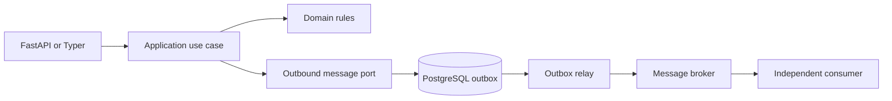
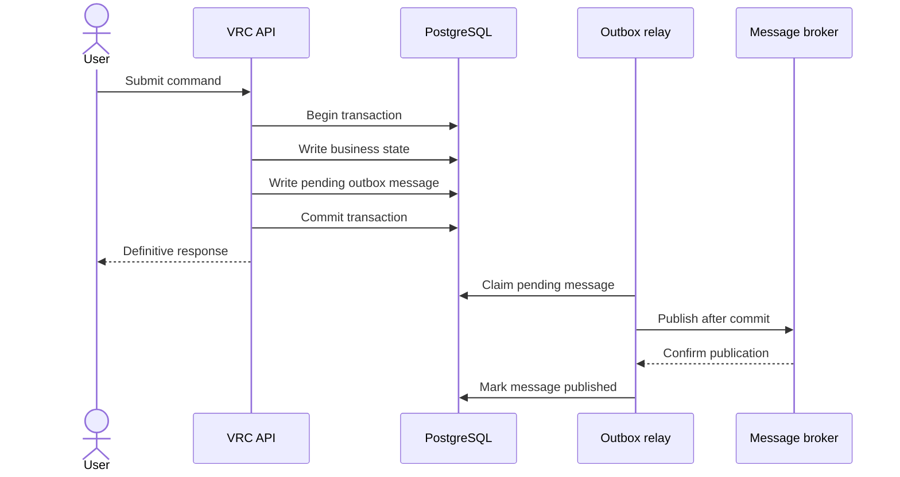
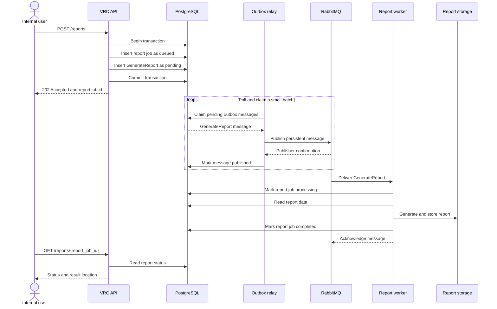
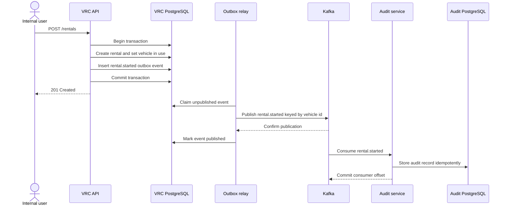
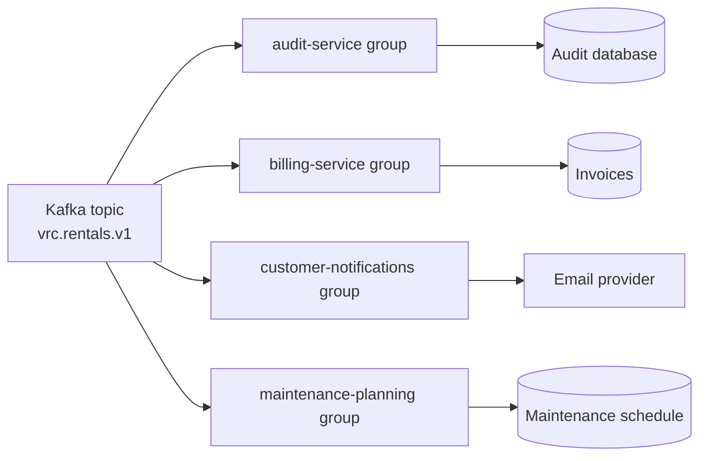

# Messaging roadmap

## Status and intent

This document describes future capabilities; none of the components below are part of
the current runtime.

Vehicle Rental Core currently has no workflow that benefits from putting a message
broker in its critical path. Starting and completing rentals are transactional
request-response operations: the caller needs to know whether the operation succeeded,
and the rental and vehicle changes must commit together. The implementation uses async
Python and database I/O to serve concurrent requests, but that does not make the
business workflow event-driven.

Messaging will be introduced only for work that is naturally asynchronous or belongs
to another bounded context. The two proposed stages deliberately solve different
problems:

| Stage | Use case | Broker | Message meaning |
| --- | --- | --- | --- |
| Roadmap 1 | Generate reports outside the HTTP request | RabbitMQ | Command: `GenerateReport` |
| Roadmap 2 | Feed an independently owned audit history | Kafka | Fact: `RentalStarted`, `RentalCompleted`, etc. |

## Integration boundary

Broker clients do not belong in the domain model or in HTTP routes. When messaging is
implemented, the application layer will express the intention to emit a message
through an application-owned outbound port. A PostgreSQL adapter will persist that
message to an outbox table; it will not contact the broker during the request.



The port is an interface owned by the application layer. The PostgreSQL outbox writer
and broker publisher are infrastructure adapters. As a result, neither domain entities
nor use cases import RabbitMQ or Kafka libraries.

### Why a transactional outbox

Publishing directly inside the request creates a dual-write problem:

1. The database commit can succeed and broker publication can fail.
2. Broker publication can succeed and the database transaction can roll back.

There is no safe ordering of those two independent commits. Instead, the business
change and the outbox row are written in one PostgreSQL transaction. After that commit,
a separate relay can retry publication without rerunning the business operation.



The outbox is transport infrastructure, not a report or audit entity. A shared envelope
can carry different message types:

```text
id                 UUID, stable message identifier
message_type       e.g. GenerateReport or RentalStarted
schema_version     payload contract version
aggregate_type     e.g. report or rental
aggregate_id       related entity identifier
payload            JSONB message body
status             pending, publishing, published, or dead
attempts           publication attempts
available_at       earliest retry time
locked_until       expired claims can be recovered
published_at       successful publication time
created_at         creation time
```

## Roadmap 1: asynchronous reports with RabbitMQ

Report generation can become slow or resource-intensive as the data set grows. It does
not need to keep an HTTP connection open, which makes it a natural job-queue use case.

### Request-to-result flow



The relay polls `outbox_messages`, not `report_jobs`. If a worker polled report jobs and
performed them directly, the database table would already be the job queue and
RabbitMQ would add little value.

The three related state machines remain separate:

```text
Outbox message: pending -> publishing -> published
                              |-> pending (retry with backoff)
                              |-> dead (retry limit reached)

Report job:     queued -> processing -> completed
                                  |-> failed

Rabbit message: ready -> unacknowledged -> acknowledged
                                      |-> requeued or dead-lettered
```

### Publisher: the outbox relay

The relay is a long-running process, not a database trigger and not a FastAPI background
task. A simple implementation repeatedly:

1. Claims a small batch of available outbox rows.
2. Publishes each message to RabbitMQ outside the database transaction.
3. Waits for a RabbitMQ publisher confirmation.
4. Marks confirmed messages as `published`.
5. Returns failed messages to `pending` with exponential backoff, eventually marking
   them `dead` after the configured retry limit.

Multiple relay instances can claim work safely using a short lease and PostgreSQL
`FOR UPDATE SKIP LOCKED`. The database lock is released after the claim; it is not held
while waiting on the network. An expired lease allows another relay to recover work
from a crashed instance.

PostgreSQL `LISTEN/NOTIFY` could later reduce polling latency, but it would only be a
wake-up hint. The durable source of truth remains the outbox table. Change-data-capture
systems such as Debezium are another future option, but add unjustified operational
weight for this project.

### Consumer: the report worker

The report worker consumes `GenerateReport` commands and acknowledges a RabbitMQ
message only after the report result and final job state are durable. Transient failures
are retried; poison messages move to a dead-letter queue for inspection instead of
retrying forever.

The worker must be idempotent. A report job can use a processing lease and a stable
artifact key derived from its id. On delivery, the worker can then:

1. Acknowledge immediately if the job is already `completed`.
2. Claim a `queued` job or recover one whose processing lease expired.
3. Requeue later if another worker still owns a valid lease.
4. Store the result at the stable key and atomically mark the job `completed`.

A processed-message table with a unique `message_id` can provide an additional dedupe
guard. This matters because a relay can crash after RabbitMQ accepts a message but
before the outbox row is marked `published`, causing a valid duplicate publication.

The resulting delivery guarantee is **at least once**, with idempotent processing. The
design does not claim exactly-once delivery.

### Deployment shape

The first roadmap does not require microservices. The API, relay, and worker can share
one repository and one container image while running different commands:

```text
api              FastAPI request-response service
outbox-relay     PostgreSQL-to-RabbitMQ publisher
report-worker    RabbitMQ consumer and report generator
postgres         transactional state and job status
rabbitmq         work queue
report-storage   local volume for development, object storage in production
```

Docker Compose would start these as separate services so their lifecycles and scaling
are independent. The report worker can scale horizontally without scaling the API.

## Roadmap 2: independent audit service with Kafka

Auditing is a different capability from reporting. An audit record describes a fact
that already happened and may need long retention, replay, independent access controls,
and additional consumers. At that point it deserves a separate service and database.
RabbitMQ would still handle report jobs; Kafka would carry business events that more
than one service may want to observe.

### First topic and event contract

The first topic would be `vrc.rentals.v1`. It would contain the rental lifecycle facts
`rental.started` and `rental.completed`, rather than commands asking another service to
perform the rental. Vehicle Rental Core remains the only service allowed to decide and
persist those transitions.

Messages would use `vehicle_id` as their Kafka key. Kafka guarantees ordering within a
partition, so this keeps the start and completion of a rental—and the next rental of
the same vehicle—in order for consumers interested in that vehicle. A `rental_id` key
would order one rental but would not preserve the sequence between successive rentals
of the same vehicle.

An initial event contract could look like this:

```json
{
  "event_id": "4fc4a8b8-44dd-4c6c-b538-c4864536dd25",
  "event_type": "rental.completed",
  "schema_version": 1,
  "occurred_at": "2026-08-27T12:30:00Z",
  "rental_id": "0ff7ca4d-53de-421b-9a1c-f7c5469d334c",
  "vehicle_id": "4ca79357-1850-464a-8551-9922a2949bb7",
  "customer_id": "c2bb7e91-6ad0-40c3-a011-327001ece21e",
  "data": {
    "start_at": "2026-08-25T09:00:00Z",
    "end_at": "2026-08-27T12:30:00Z"
  }
}
```

The topic key is `vehicle_id`; it does not need to be duplicated as the event id.
`event_id` identifies one publication and gives consumers a stable idempotency key.
Names, email addresses, and other customer details stay out of the event. A consumer
that is authorized to contact a customer can resolve `customer_id` through its own
data or an explicit customer-data contract.



Vehicle Rental Core remains the source of truth for vehicles and rentals. The audit
service owns only its audit projection and is never called synchronously from the
rental transaction. If Kafka or the audit service is temporarily unavailable, rentals
continue and the relay catches up later.

Kafka fits this stage because the topic becomes a durable history that each interested
capability can read at its own pace or replay later. It is not being introduced merely
as a different way to run background jobs.

### Consumer groups with a business purpose

The first consumer group would be `audit-service`. It would read every rental event and
build the independent audit projection shown above. Later groups could subscribe to the
same topic without changing Vehicle Rental Core:

- **`billing-service`:** reacts to `rental.completed` to start the invoice workflow.
  Before adding this consumer, the contract would be extended with the agreed pricing
  snapshot, currency, and other facts billing must own.
- **`customer-notifications`:** reacts to starts and completions to send confirmation
  emails. The event carries the customer id, not the email address itself.
- **`maintenance-planning`:** uses completed rentals to update usage history and decide
  when a vehicle should be inspected or moved to maintenance.



Each capability needs its own group. That is what lets audit, billing, notifications,
and maintenance each receive the event. Multiple instances inside one group share the
topic partitions and process the group's workload in parallel; putting two different
capabilities in the same group would make them compete for events instead.

Only `audit-service` belongs to the initial Kafka milestone. The other groups describe
concrete extension points and would be added only when their business requirements
exist. A later `vrc.vehicles.v1` topic, also keyed by `vehicle_id`, could carry facts
such as `vehicle.maintenance_started` or `vehicle.retired`; it should not be created
until a real subscriber needs those events.

### Delivery behavior in practical terms

The outbox still protects the handoff from PostgreSQL to Kafka. Once an event is in the
topic, every consumer progresses independently. If the audit service is offline, the
API continues accepting rentals and audit resumes from its last committed offset when
it returns.

A consumer stores `event_id` under a unique constraint and commits its Kafka offset
only after its local database change succeeds. A crash between those two steps can
deliver the event again, so processing must be idempotent. Ordering is guaranteed only
for events with the same `vehicle_id`; the system does not depend on a global ordering
of every rental.

The first operational checks should answer simple questions: Is the outbox growing?
Is the audit group falling behind? Are events repeatedly failing? Logs carry the event
id, type, vehicle id, and consumer group so an operator can follow one event from VRC
to its consumer without logging customer data.

### How this roadmap would be delivered

1. **Define the contract.** Agree on `vrc.rentals.v1`, the two initial event types,
   `vehicle_id` as the key, and compatibility rules for schema changes.
2. **Publish safely.** Add the outbox writer and Kafka relay, with integration tests for
   commit, retry, and duplicate-publication scenarios.
3. **Deliver the audit MVP.** Run a separate `audit-service` consumer group and database
   in Docker Compose, then prove that it catches up after being stopped and restarted.
4. **Operate it.** Add consumer-lag alerts, retention settings, access controls, and a
   documented replay procedure before treating the audit history as production-ready.
5. **Add subscribers when justified.** Billing, notifications, or maintenance receive
   their own consumer groups only when those capabilities are implemented.

Roadmap 1 and Roadmap 2 are independent. RabbitMQ can be introduced for reports without
committing the project to Kafka, while Kafka should wait until audit ownership or
multiple event consumers make a durable event stream worthwhile.
